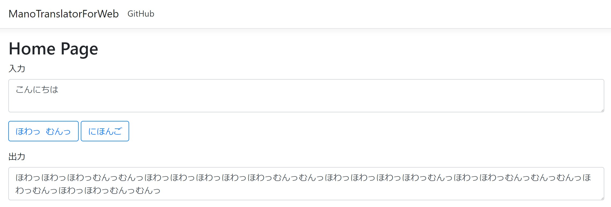

# ManoTranslatorForWeb

ManoTranslatorのWeb版 https://manotranslatorforweb.azurewebsites.net

## Development Environment
* Windows 10 Home
* Visual Studio 2017 Enterprise

## Dependency
* .NET Core 2.0
* ASP.NET Core MVC
* [ManoTranslator](https://github.com/para7/ManoTranslator)

## Author

[@science507](https://twitter.com/science507)
